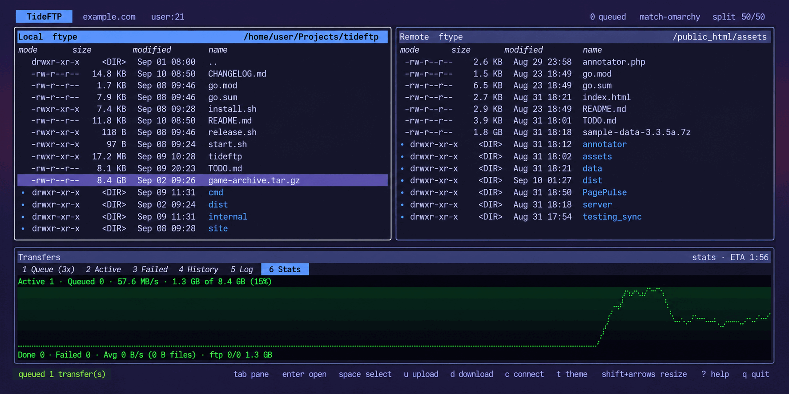

# TideFTP

TideFTP is a keyboard-first, mouse-friendly terminal file transfer client for
SFTP, FTP and FTPS, built with Go, Bubble Tea, and TideUI.



- FileZilla-style layout: local pane, remote pane, wide transfer pane.
- A real transfer queue — parallelism, per-file and overall ETA, retry,
  resume, conflict policies.
- Directory mirror (`M`) with a pre-flight plan and opt-in prune.
- Streaming preview and in-place edit without downloading the whole file.
- A scriptable mode for shell, cron and CI: `get`, `put`, `ls --json`, `sync`
  (dry-run, parallel, optional delete), one-connection `script`/`shell`, and
  distinct exit codes — sharing the same connection handling as the app.
- Strict host-key checking; passwords are never passed as flags.
- `tide-night` default theme plus a live theme picker, soft modal screens,
  shift-arrow pane resizing. `match-omarchy` follows your current
  [Omarchy](https://omarchy.org) desktop theme (contrast-corrected, repaints
  live when you switch it).

## Install

```bash
curl -fsSL https://raw.githubusercontent.com/allisonhere/TideFTP/main/install.sh | sh
```

The installer drops a binary in `~/.local/bin` (set `INSTALL_DIR` for
elsewhere) — no system password. Or grab an archive from the
[latest release](https://github.com/allisonhere/TideFTP/releases/latest).

## Updating

TideFTP checks GitHub once at launch for a newer release. When there is one,
the topbar says so and `U` opens a confirmation; accepting downloads the
release archive, verifies it against the release's `SHA256SUMS`, replaces the
binary in place, and offers to restart into it. Downloads are only ever
accepted from `github.com`, and an archive whose checksum is missing or does
not match is refused rather than installed.

**This is the one thing TideFTP contacts that you did not type in.** It is a
single request to `api.github.com` per launch, sending nothing but the
request itself. Turn it off in Settings (`,` → *Check for updates*), or in
`config.toml`:

```toml
[updates]
check_on_startup = false
```

`i` in the update prompt ignores that one version and keeps quiet until the
next release. A build that is not a tagged release — `go run`, anything
reporting `dev` — never checks at all, since it has nothing to compare
against. If the binary lives somewhere you cannot write, TideFTP says so and
prints the command to finish the job instead of failing silently.

## Run

```bash
./start.sh          # or: go run ./cmd/tideftp
```

That opens the app disconnected, ready for `c`. To connect straight to a
server:

```bash
# SFTP (the default protocol)
go run ./cmd/tideftp --host files.example.com --user allie --path /srv/www

# FTP, or FTPS with explicit TLS
TIDEFTP_FTP_PASSWORD=... go run ./cmd/tideftp --protocol ftps \
    --host files.example.com --user allie --path /pub

# FTPS with implicit TLS, the older port-990 flavour
TIDEFTP_FTP_PASSWORD=... go run ./cmd/tideftp --protocol ftps-implicit \
    --host files.example.com --user allie --path /pub
```

For deterministic UI and recovery testing, run `tideftp --transfer-lab`. It
uses the demo adapter and adds **Transfer Lab** to the Command Palette, with
tiny-file, large-file, mixed-batch, and injected-connection-drop scenarios.
It never contacts a real server or writes real transfer data.

The two FTPS flavours are separate protocols because a server speaks one or
the other, never both on the same port. **`ftps`** is explicit FTPS: an
ordinary FTP connection on port 21 that `AUTH TLS` upgrades in place.
**`ftps-implicit`** is implicit FTPS: the TLS handshake happens first, before
any FTP command, on port 990. Pointing one at the other does not fall back —
an implicit server sends no greeting until it has a `ClientHello`, so the
explicit client would sit waiting — which is why there is nothing to
auto-detect and the picker asks.

SFTP authenticates with the SSH agent, the usual `~/.ssh` keys, or `--identity`
for a specific key file. Host keys are checked strictly against
`~/.ssh/known_hosts` (`--known-hosts` to point elsewhere); there is no option to
skip that check.

Both FTPS flavours verify the server certificate, and all three `--ftps-*`
flags apply to either. For a self-signed certificate, trust it with
`--ftps-ca cert.pem` rather than turning verification off; `--ftps-insecure`
exists but accepts anything. FTPS is capped at TLS 1.2 by default because some
servers mishandle TLS 1.3 on data connections, corrupting uploads over 16 KB —
`--ftps-allow-tls13` lifts the cap.

FTP and both FTPS flavours need a password. It is read from `TIDEFTP_FTP_PASSWORD`, and SFTP
will use `TIDEFTP_SFTP_PASSWORD` if key-based methods do not work. Passwords are
deliberately not flags: a flag puts the secret in the process table for every
other user on the machine to read.

Check the version of a built binary with `tideftp --version` (release builds inject it
via `-ldflags "-X main.version=$VERSION"`; `go run`/`go build` without that flag reports
`dev`).

## Scripting

> **Full guide:** [docs/scripting.md](docs/scripting.md) — connecting, exit
> codes, JSON, resume/reconnect, sync and mirror, script files, recipes, cron
> and troubleshooting. What follows is the short version.

The same binary runs without the TUI: give it a command word and it connects,
acts and exits. It takes the connection flags above (or `--profile NAME`).

```bash
tideftp ls    [--json] [PATH...]           list; globs work in the last component
tideftp stat  [--json] PATH...             type, size, mode, mtime
tideftp exists [-f|-d] PATH...             silent; exit 0 if all exist, 5 if not
tideftp get   [-r] [-c] [-O DIR] REMOTE... [LOCAL]    download (reget = get -c; mget = get)
tideftp put   [-r] [-c] [-O DIR] LOCAL... [REMOTE]    upload   (reput = put -c; mput = put)
tideftp pget  [-n N] REMOTE [LOCAL]        download ONE file over N connections
tideftp rm [-r] PATH...   rmdir PATH...   mkdir [-p] PATH...   mv OLD NEW   (mrm = rm)
tideftp cat PATH...   du [-h] [-d N]   find [--name G --type f|d --min-age 7d]   tree [-L N]
tideftp chmod [-R] 755|u+x,go-w PATH...    ln -s TARGET LINK    readlink PATH
tideftp sync   [flags] SRC DST             one-way mirror between local/server/server
tideftp mirror [-R] [flags] [REMOTE [LOCAL]]   the same engine with lftp's arguments
tideftp script [-c CMDS | FILE]            many commands over ONE connection
tideftp shell                              the same, interactively
tideftp help [COMMAND]
```

```bash
tideftp get --profile prod /var/log/app.log ./logs/
tideftp put --profile prod ./build.tar /releases/
tideftp get --profile prod '/logs/*.gz' ./logs
if tideftp exists -f --profile prod /srv/ready.flag; then …; fi
```

- **Exit codes:** `0` success, `1` an operation failed, `2` usage, `3` could not
  connect, `4` authentication rejected, `5` a path was not found.
- **Output:** results on stdout, notices on stderr. `--progress` adds a live
  percent/size/speed/ETA line to `get` and `put` (redrawn in place on a
  terminal, a plain line every 5s otherwise); it is off by default. `-q` silences
  everything but errors. `ls`/`stat`/`find --json` print
  `{name, path, type, size, mode, modified}`.
- **Passwords are never flags:** `TIDEFTP_SFTP_PASSWORD` /
  `TIDEFTP_FTP_PASSWORD`, a saved profile's keyring entry, or
  `--password-stdin` (first line of stdin). `--host-key-policy` is `strict` by
  default — an unknown host key fails with its fingerprint — and `off` accepts any.
- **Safe writes:** existing destinations are never overwritten without
  `--force`. `put` and `sync` upload to `NAME.part` and rename when complete
  (`--no-part` to disable).
- **Wildcards** work in the last component of a remote path (`'/logs/*.gz'`);
  like a shell they skip dotfiles, and a pattern that matches nothing is exit
  `5`. `get`/`put` take several sources, the last operand being the destination
  directory (or use `-O DIR`).

### Speed, reconnects and resuming

- `--bwlimit 2M` caps speed (`500k`, `2M`; shared across parallel files).
- **A dropped connection is not the end of a transfer.** `--retries N` (default
  `3` for `sync`, `mirror` and `script`; `0` elsewhere; `-1` = forever) makes
  commands redial with 1s, 2s, 4s… backoff and carry on, **resuming a
  half-moved file from where it stopped**. `--timeout` bounds each connect.
- `get -c` / `reget`, `put -c` / `reput` and `sync --resume` continue a partial
  file left by an earlier run. Without them, a stale partial file is discarded —
  the source may have changed.
- `pget -n 4 REMOTE` (and `sync --use-pget-n 4`) fetch one big file over
  several connections at once; each connection takes a byte range.

### Sync and mirror

`sync SRC DST` makes DST match SRC, one way. Either side is a local directory
or a server: `PROFILE:/path` uses a saved profile, `:/path` the connection
flags. Put `./` before a local path that contains a colon (a one-letter prefix
is a Windows drive, so a profile cannot be named `c`). Server-to-server works
too; bytes relay through a temp file here.

```bash
tideftp sync ./site prod:/var/www
tideftp sync --dry-run --delete ./site prod:/var/www     # preview, incl. deletions
tideftp sync prod:/var/log ./logs --include '*.gz' --max-age 7d
tideftp sync prod:/data staging:/data --transfers 8 --bwlimit 5M
tideftp mirror -R --delete -x '\.tmp$' ./site /var/www   # lftp spelling
```

- **Comparison:** size, then modification time (source more than 2s newer).
  `--checksum` hashes same-size files; `--size-only`/`--ignore-time` ignore
  time; `--only-newer` never updates on size alone; `--only-missing` only adds.
  Uploads and downloads preserve mtime and (where the server allows)
  permissions, so the next run sees equal files; `--no-perms` skips the modes.
- **Deleting is opt-in:** `--delete` runs only after every copy succeeded
  (`--delete-first` to flip that), and an empty source refuses to delete
  unless `--allow-empty-source`. A file merely filtered out by size or age is
  never treated as deleted from the source.
- **Filters:** `--include`/`--exclude` globs (no slash: match the name; with a
  slash: the path under the root), `--include-regex`/`--exclude-regex`,
  `--min-size`/`--max-size` (`10k`, `5M`), `--min-age`/`--max-age` (`2h`, `7d`),
  `--newer-than`/`--older-than` (a date or a file), `--no-recursion`,
  `--no-empty-dirs`, `-L`/`--dereference` to follow symlinked directories.
- **Control:** `--dry-run`, `--transfers N` (one connection each),
  `--verify` (re-hash after transfer), `--max-errors N`,
  `--on-change CMD` (runs only if something changed), `--log FILE`.
- A failure on one file does not stop the others; exit `1` if anything failed.
- **`mirror` is lftp-shaped:** `mirror [REMOTE [LOCAL]]` downloads (LOCAL
  defaults to REMOTE's name), `mirror -R [LOCAL [REMOTE]]` uploads. Its short
  options follow lftp: `-x`/`--exclude` is a regex and `-X`/`--exclude-glob` a
  glob (`-i`/`-I` likewise), `-n` only-newer, `-e` delete, `-c` continue,
  `-P N` parallel, `-L` dereference, `-p` no-perms, `-r` no-recursion.

### Scripts and the shell

Reconnecting for every command is slow and trips server login limits.
`script` connects once and runs a list of commands over that connection:

```bash
tideftp script --profile prod -c 'cd /var/www; lcd ./build; put index.html; chmod 644 index.html'
tideftp script --profile prod deploy.tide        # one command per line
tideftp shell --profile prod                     # interactive; prompt on stderr
```

- All the commands above work, plus `cd`, `lcd`, `pwd`, `lpwd`, `echo`,
  `!shell command`, `help CMD`, `exit [N|kill]`. Words split on whitespace;
  `'single'` and `"double"` quotes and `\` escapes work, `;` or a newline ends a
  command, `#` starts a comment, a trailing `\` continues a line.
- **Settings and aliases:** `set net:limit-rate 1M`, `net:max-retries`,
  `net:reconnect-interval-base`, `net:timeout`, `mirror:parallel`,
  `cmd:fail-exit` (`set` alone lists them); `alias ll ls -l`; `source FILE`.
  A `cli.rc` beside `config.toml` (or `--rc FILE`; `--no-rc` skips it) may hold
  `set`, `alias`, `echo` and `source` lines.
- **Several servers:** `open PROFILE|HOST` connects (a script may start with no
  `--host` at all), `close` disconnects; `open` again switches servers.
- **Background work:** a trailing `&` runs a command on its own connection;
  `queue CMD` runs commands one after another in the background on one
  connection; `jobs`, `wait [N]`, `kill N|all`. A script waits for its jobs at
  the end unless it exits with `exit kill`.
- A script stops at the first failing command and exits with that command's
  exit code. `-k` keeps going and reports the *first* failure's code (`shell`
  does this by default); `-x` echoes each command to stderr.
- Connection flags belong on `script`/`shell` itself (or on `open`); flags on an
  inner command are ignored. `sync` and `mirror` inside a script use the
  script's connection for the unnamed `:` side. `--password-stdin` cannot be
  combined with a script read from stdin.

### Coming from lftp

| lftp | TideFTP |
|---|---|
| `lftp -c 'open h; get f'` | `tideftp get --host h f`  ·  `tideftp script --host h -c 'get f'` |
| `mirror -R --delete src dst` | `tideftp mirror -R --delete src dst` (or `sync src :dst`) |
| `set net:limit-rate 1M` | `--bwlimit 1M` or `set net:limit-rate 1M` in a script |
| `set net:max-retries N` | `--retries N` or `set net:max-retries N` |
| `get -c`, `put -c`, `reget`, `reput` | the same |
| `pget -n 4 f` | `tideftp pget -n 4 f` |
| `mget`, `mput`, `mrm`, `rmdir`, `ln -s`, `find`, `du`, `cat`, `chmod` | the same |
| `cmd &`, `queue`, `jobs`, `wait`, `kill` | the same, in `script`/`shell` |
| `alias`, `source`, `!cmd`, `~/.lftprc` | `alias`, `source`, `!cmd`, `cli.rc` |

**Not supported:** HTTP/HTTPS, FISH and BitTorrent; proxies; `site`/raw `quote`
commands and FTP `chmod` (the FTP library offers no way to send them); hard
links; `&&`/`||` between commands. TideFTP speaks SFTP, FTP and FTPS only.

For example, a nightly mirror to a server whose key is already trusted:

```bash
#!/bin/sh
set -eu
tideftp mirror --profile prod --delete --log /var/log/mirror.log /var/www/uploads /srv/backups/uploads
```

## Keys

- `Tab` / `Shift+Tab`: toggle between the local and remote panes. The transfers
  pane is not in the rotation — `1`-`6` focus it along with picking a tab, a
  click focuses it, and `R` goes there on its own
- `←` / `→` (or `h` / `l`): focus the local / remote pane
- `Enter`: open directory
- `Backspace`: parent directory
- `Space`: select item
- `Ctrl+A`: select all
- `Esc`: clear an active pane filter, else clear selection, else close overlay
- `u`: upload selected/local cursor item
- `d`: download selected/remote cursor item
- `e`: edit the highlighted file in an editor (writes it back if you change it).
  The editor is the **Editor** row in Settings (`,`) — `auto` resolves `$VISUAL`,
  `$EDITOR`, `git config core.editor`, then a common editor on `PATH`. Set
  `editor` in `config.toml` to anything, including flags, e.g. `editor = "code -w"`
- `v`: open images in the default desktop image viewer. Remote images up to
  64 MB are downloaded to a temporary copy, removed when TideFTP exits.
  If a viewer is unavailable or fails to launch, use the built-in preview.
  For other files, preview reads the first 128 KB and shows it as
  syntax-highlighted text, or as a hexdump for binary content (`x` toggles,
  `esc` closes). The built-in preview never downloads the whole file. The header names the
  language that was recognised, so a file that comes out uncoloured says why
- `y`: copy the selection's full paths to the clipboard, one per line. Over SSH
  this uses OSC 52 so the paths land on *your* clipboard, not the server's;
  locally it prefers `wl-copy`/`pbcopy`/`xclip`/`xsel` and falls back to OSC 52
- `M`: mirror the focused pane (or the directory under the cursor) onto the
  other side. Walks both trees, queues only files that are missing or differ
  by size / a newer mtime, and shows a plan — new, updated, unchanged — to
  confirm. `p` in that overlay arms **prune**, which then also deletes
  anything at the destination with no source counterpart (off by default).
- `r`: refresh the visible panes
- `n`: create a folder in the focused pane
- `F2`: rename the selection or highlighted item
- `Delete`: delete the selection or highlighted item. A selection with a folder
  in it is counted first, so the prompt says how many files and folders are
  about to go rather than just "and their contents". The delete then runs as a
  job with a progress row pinned above the transfers pane — a running count, the
  path being removed, and `x` to cancel — and every removed path is written to
  the Log tab. A file that will not delete is counted and skipped rather than
  stopping the rest
- `x`: cancel a running delete; failing that, cancel transfers — everything in
  flight from a file pane, or just the row under the cursor with the transfers
  pane focused
- `R`: retry a failed transfer. From a file pane it focuses the transfers pane,
  switches to the Failed tab if the current one has no failures, and retries the
  first one; on a failed row already, it retries that row
- `+` / `-`: increase / decrease the number of parallel transfers
- `/`: filter the focused pane's listing — type to narrow it live, `enter`
  accepts the filter (normal keys resume, the listing stays narrowed), `esc`
  clears it. A query with `*`, `?` or `[` is matched as a glob against each
  name; anything else is a case-insensitive substring. `..` always stays
  visible so you can still walk up. Per pane, and dropped when the pane moves
  to another directory
- `s`: cycle the focused pane's sort key — name, size, date, type. `S`
  reverses the direction. Directories stay above files for every key except
  `type`, and `..` stays on top. Per pane, kept across navigation, and the
  focused pane's order is saved as the startup default (`sort` in
  `config.toml`)
- `m`: change permissions (chmod) on the selection or highlighted row. Enter
  an octal mode (`644`, `0755`, `2775`); the prompt pre-fills the current
  mode and echoes back the `rw-r--r--` it decodes to. Works on the local
  pane and over SFTP; plain FTP has no portable permission command, so it
  reports "not supported" there
- `b` / `B`: bookmarks. `B` bookmarks the focused pane's current directory, or
  removes it if it is already bookmarked; `b` opens the picker, where `enter`
  jumps to a bookmark, `shift+b` adds the current directory without leaving,
  and `dd` removes the highlighted one. Remote bookmarks are saved **per
  server** — `/var/www` means something different on another host — so they
  need a saved profile; connect via `c` and save the server first. Local
  bookmarks are shared across every connection. Both live in `config.toml`, as
  `bookmarks` under a profile and `local_bookmarks` at the top level
- `c`: open the connection picker (Enter connects, `e` edits, `n` / the last row adds a new one)
- `Ctrl+K`: command palette, including Disconnect while connected
- `t`: theme picker
- `,`: settings
- `i`: toggle icons (falls back to ASCII glyphs, same as the vt52 theme)
- `.`: toggle hidden files
- `Shift+Left` / `Shift+Right`: resize local/remote panes
- `Shift+Up` / `Shift+Down`: resize transfer pane
- `Ctrl+0`: reset pane sizes
- `1`-`5`: focus the transfers pane and open Queue, Failed, History, Log, or
  Stats respectively
- `U`: install a waiting update
- `?`: help
- `q`: quit

## Transfers

A running transfer's row shows its live throughput and time remaining, and the
transfers pane header carries an ETA for everything still queued or running.
Both are estimated from the average rate of the transfers actually in flight,
so they settle down after the first few seconds rather than being right
immediately.

Two settings in `,` change what happens around a transfer:

- **Verify** (`verify_checksums`, off by default) re-reads both ends of every
  completed transfer and compares SHA-256 sums. A mismatch moves the transfer
  to the Failed tab, where `R` retries it. This doubles what a transfer costs
  in time and bytes — it is correctness you opt into, not a free check.
- **Reconnect** (`auto_reconnect`, on by default) redials after a connection
  drops on its own, backing off from 2 seconds through 5 minutes over eight
  attempts, and puts you back in the directory you were in. A disconnect you
  asked for is never undone, and connecting somewhere by hand calls off a
  redial in progress. After a successful reconnect, interrupted transfers are
  checked and grouped in a review panel: `enter` resumes the safe ones
  (missing destinations, or partials whose contents match the source, capped
  at 16 MB for automatic verification), `r` restarts the mismatched/full ones
  from zero, `s` skips them, and `↓` inspects the individual Failed rows. Set
  `recover_interrupted_transfers = false` to reconnect without restarting
  interrupted work.
- **Connectivity check** (`check_connectivity`, on by default) watches for
  transfers failing back to back. Two in a row earns one quick reachability
  probe — a local network check plus a short TCP dial to the server — and if
  the link is down the queue is held with a banner and re-checked on a
  backoff, instead of firing every remaining file at a dead connection.
  SFTP sessions also send keepalives, so a silently dead TCP path is noticed
  rather than lingering as a live connection.

## Development

The protocol adapter packages include hermetic tests and optional LAN tests
for the real FTP, FTPS, and SFTP adapters.

```bash
go test ./...             # hermetic; safe anywhere
go test -race ./...       # the adapters and the transfer engines are concurrent
go vet ./...
```

## Releasing

Version comes from the git tag, injected at build time via
`-ldflags "-X main.version=$TAG"`.

Run `./release.sh` for the guided path: a small TUI that picks the
patch/minor/major bump, takes a commit message, and — after a double-press
confirm — runs `go test ./...`, checks the worktree, verifies `main` is in
sync, then commits, pushes `main`, and pushes the version tag.

Or do it by hand:

1. Update `CHANGELOG.md` with a `## vX.Y.Z` section.
2. `git tag vX.Y.Z && git push origin vX.Y.Z`

Either way the tag push is what starts `.github/workflows/release.yml`, which
cross-compiles Linux and macOS (x86_64 + aarch64) binaries, writes
`SHA256SUMS`, and publishes a GitHub release with notes pulled from that
changelog section. `install.sh` fetches from `releases/latest`.


